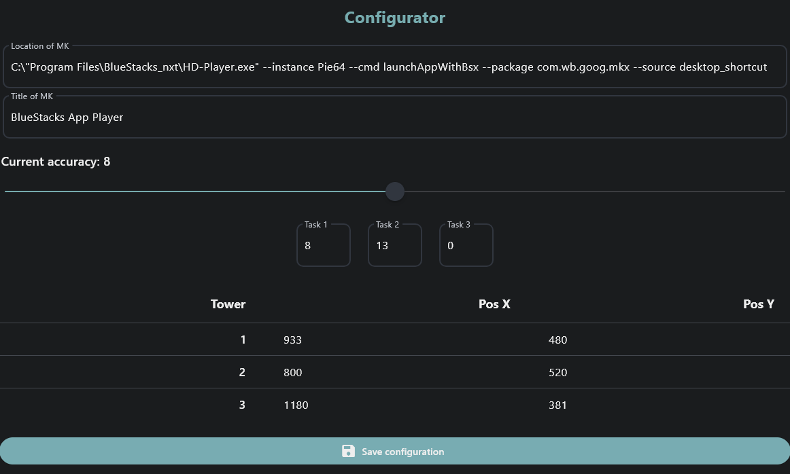

# AutoMKXM

## Description
AutoMKXM is a project to make an automate gameplay of Mortal Kombat X Mobile. Via AutoMKXM you can claim your rewards
from tasks, pass challenges and fraction fights. In the future AutoMKXM will pass dungeon.

## Installation

To use AutoMKXM you need do several things. First you need to install source from GitHub. Run below command in terminal 
or download zip file from [github.com](https://github.com/Fempty34/AutoMKXM/archive/refs/heads/main.zip). Also, you need
[Python 3](https://www.python.org/downloads/) on your system.
```bash
git clone https://github.com/Fempty34/AutoMKXM.git
```
Then go to the project directory and install requirements.
```bash
pip install -r requirements.txt
```

## How to use it 
To run AutoMKXM, go to the downloaded directory and run the following command. 
```bash
python3 app/app.py
```
After that you will see the AutoMKXM configurator. Here you must select several required parameters.



* __Location of MK__ - Specify the path to the MK starter file, that will be used to run the MK on your PC.
* __Title of MK__ - Specify the title of the MK window
* __Title of useless window__ - Specify the title of useless window, that will be closed automatically after start.
* __Current accuracy__ - This parameter used by OpenCV library to detect buttons. Try to increase it if AutoMKXM do not
work correctly.
* __Tasks__ - Select tasks that will be used by AutoMKXM to claim reward. Don't forget to deactivate old tasks before
starting AutoMKXM.
* __Tower__ - Specify towers locations by cursor tool.

Press Save Configuration button to save configuration and start AutoMKXM. If you want to stop AutoMKXM or edit it open 
the configurator in trey menu.

## Technologies used

* __OpenCv__ - the most popular and powerful library in python that provides the computer's sight and detection.
* __Flet__ - my favorite python framework to make GUI. There are so many different completed widgets and it has
possibility to design your own.
* __PyAutoGui__ - library to control system and interact with it.

